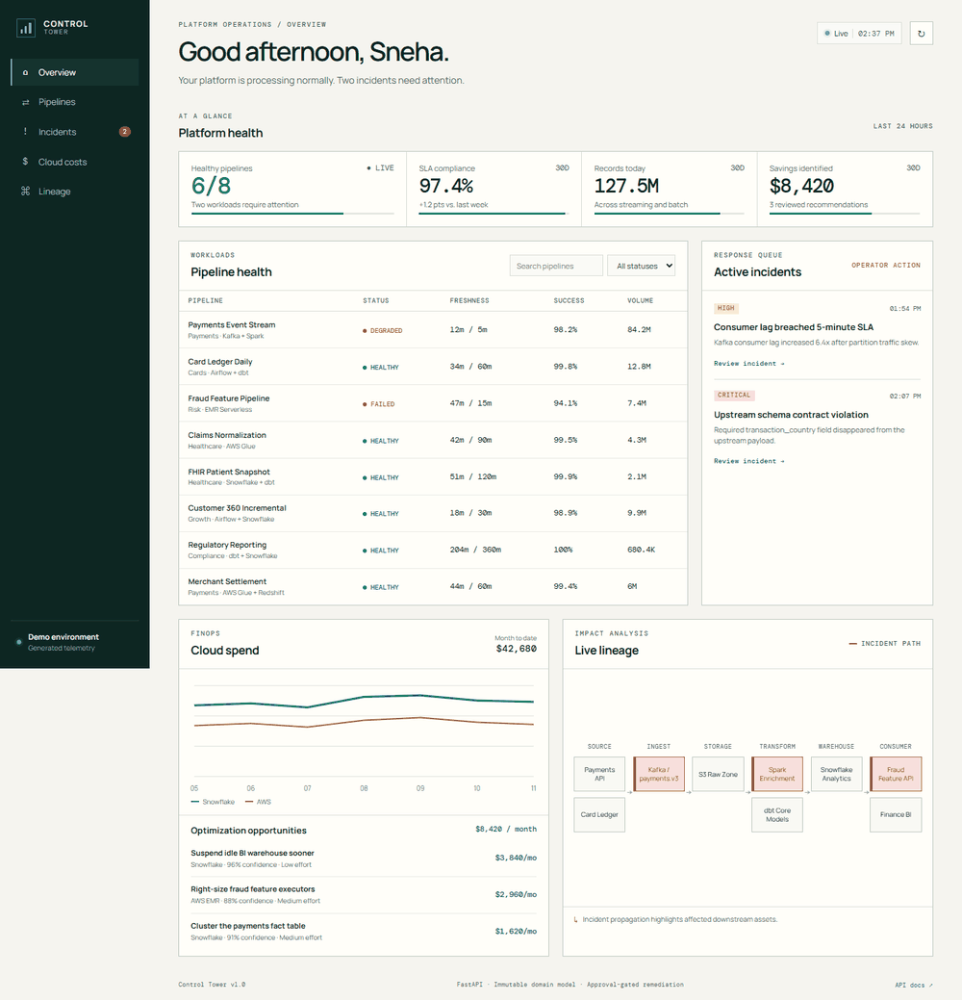

# Data Platform Control Tower

A portfolio-ready operations console for monitoring pipeline health, incidents, lineage, SLAs, and cloud spend across a modern data platform.

The included demo is fully local and deterministic: it does not require AWS, Snowflake, Airflow, or an API key. It models the operational signals those systems provide and exposes adapter-ready API boundaries for future live integrations.



## What reviewers can see

- Eight batch and streaming pipelines with status, freshness, SLA, success rate, and volume
- Incident triage with root-cause context, blast-radius analysis, and approval-gated remediation
- Snowflake and AWS cost trends plus ranked monthly savings recommendations
- Lineage from operational sources through Kafka, Spark, dbt, and Snowflake to consumers
- Responsive, keyboard-accessible UI with loading, error, filtering, and empty states
- Immutable Pydantic domain models, consistent API envelopes, security headers, and audit events
- Automated unit and API tests with an enforced 80% coverage floor

> All names, metrics, incidents, and cost figures in demo mode are synthetic. No employer or customer data is included.

## Quick start

### Docker

```bash
docker compose up --build
```

Open <http://localhost:8000>. Interactive API documentation is available at <http://localhost:8000/api/docs>.

### Python

```bash
python -m venv .venv
# Windows: .venv\Scripts\activate
# macOS/Linux: source .venv/bin/activate
pip install -r requirements-dev.txt
uvicorn app.main:app --reload
```

Run verification:

```bash
pytest
```

## Architecture

```text
Airflow / Snowflake / AWS (demo telemetry in this repository)
                         │
                         ▼
              Immutable domain service
              aggregation · validation
              incident state transitions
                         │
                         ▼
                   FastAPI routes
              consistent response envelope
                         │
                         ▼
              Operations dashboard UI
       health · incidents · costs · lineage
```

The write path is deliberately narrow. An incident can move from `awaiting_approval` to `remediation_queued` only through the validated approval endpoint. The demo records the actor, time, action, and proposed command in an immutable audit event; it never executes cloud commands.

## API

| Method | Endpoint | Purpose |
|---|---|---|
| `GET` | `/api/dashboard` | Fetch the complete dashboard snapshot |
| `GET` | `/api/pipelines` | Filter pipelines by status or search query |
| `GET` | `/api/incidents` | List incident history |
| `POST` | `/api/incidents/{id}/approve` | Record an approval and queue remediation |
| `GET` | `/api/costs/recommendations` | List ranked FinOps recommendations |
| `GET` | `/api/lineage` | Fetch connected lineage nodes and edges |
| `GET` | `/api/health` | Container health probe |

Every endpoint returns:

```json
{
  "success": true,
  "data": {},
  "error": null
}
```

## Production integration path

1. Replace the demo telemetry constants with read-only adapters for Airflow's REST API, Snowflake `ACCOUNT_USAGE`, and AWS CloudWatch/Cost Explorer.
2. Store incidents and audit events in PostgreSQL with optimistic concurrency.
3. Protect approval routes with SSO/RBAC and require an idempotency key.
4. Publish approved commands to a queue; execute them through a least-privilege worker with allow-listed runbooks.
5. Add OpenTelemetry traces and deploy behind a TLS-terminating reverse proxy.

## Security choices

- No secrets, tokens, or customer data are stored in the repository.
- Inputs are schema-validated and actor names are length- and character-restricted.
- The app emits CSP, clickjacking, MIME-sniffing, referrer, and browser-permission headers.
- The container runs as a non-root user.
- GitHub Actions uses read-only repository permissions.
- Remediation is approval-gated and non-executing in demo mode.

## Repository structure

```text
app/
  demo_data.py       Synthetic platform telemetry
  main.py            API routes and web application
  models.py          Immutable API and domain models
  services.py        Aggregation and incident state transitions
  static/            Responsive dashboard UI
tests/               Unit and API integration tests
.github/workflows/   Test and container CI
```

## License

[MIT](LICENSE)
